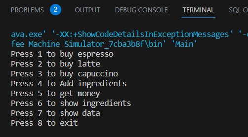
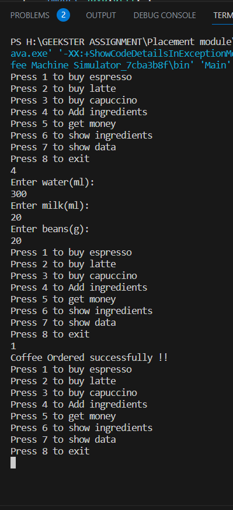
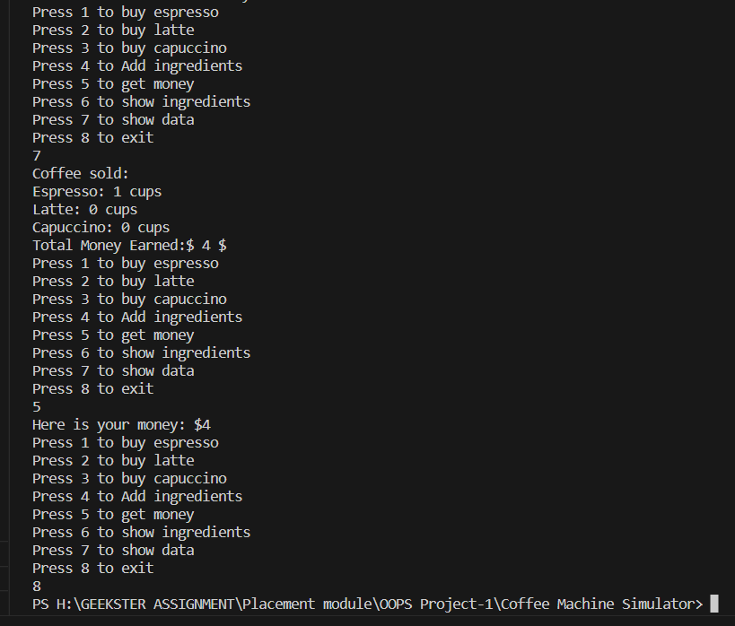

<h1 align="center"> Coffee Machine Simulator ☕</h1>

A Coffee Machine Simulator is a digital tool that provides a virtual coffee-making experience, allowing users to practice, learn, or simply enjoy the process of brewing coffee without the need for physical coffee-making equipment. It can be both educational and entertaining for coffee lovers and those interested in honing their barista skills.


## **Features**

- **Buy Coffee:** Users can select from three different types of coffee (Espresso, Latte, Cappuccino), each with its price and ingredient requirements. The machine dispenses coffee if there are enough ingredients.

- **Espresso:** price - $4/cup, water needed – 250 ml/cup, milk needed – 0 ml/cup, beans needed - 16/cup

- **Latte:** price - $7/cup, water needed – 350 ml/cup, milk needed – 75 ml/cup, beans needed - 20/cup

- **Cappuccino:** price - $6/cup, water needed – 200 ml/cup milk needed – 100 ml/cup beans needed - 12/cup.

- **Add Ingredients:** The simulator allows users to refill the machine with water, milk, and coffee beans, ensuring a constant supply of ingredients.

- **Take Money:** The maintainer can easily withdraw the money collected from coffee sales, helping track earnings.

- **Show Ingredients:** Users can check the current levels of water, milk, coffee beans, and the amount of money in the machine.

- **Exit Option:** The simulation can be terminated gracefully when the user is done.

- **Data Analytics:** There's an analytics feature to display key statistics:

- **Intuitive REPL Interface:** The application features a user-friendly Read-Eval-Print Loop (REPL) console interface, making it easy for users to interact with the simulator.


## **Getting Started**

To run the Coffee Machine Simulator, follow these steps:

**1.** Ensure you have Java installed on your system.

**2.** Download the source code files or clone the repository.

**3.** Compile the Java source files using the following command:

```bash
  javac CoffeeMachine.java
```
**4.** Run the application with the following command:
```bash
  java CoffeeMachine
```
**5.** Follow the on-screen instructions to interact with the Coffee Machine Simulator.
    
## **Usage**

Once the application is running, you will be presented with a menu of actions to choose from. Enter the corresponding number for the action you want to perform:






Follow the prompts and enter the required information as requested by each action.


## **OOPS Concepts Used**

In the Coffee Machine Simulator code provided, several Object-Oriented Programming (OOP) concepts have been utilized. Here are the OOP concepts used in the implementation:

**1.Classes and Objects:**

- The **`CoffeeMachine`** class represents the coffee machine and encapsulates its state and behavior.
- The **`Main`** class contains the main method and serves as the entry point of the program.

**2.Encapsulation:**

- The **`CoffeeMachine`** class encapsulates the internal state of the coffee machine, such as the amounts of water, milk, coffee beans, and money.


## **Contributing**

Contributions to the Coffee Machine Simulator project are welcome! If you find any bugs or have suggestions for improvement, please open an issue or submit a pull request.


## **License**📝

This project is generated by [@Nikita Parate](https://github.com/nikitaparate193)


## **Acknowledgements**

The Coffee Machine Simulator was developed as an example implementation based on OOPs concepts.


## **Disclaimer**✍️

This Coffee Machine Simulator is a simplified program for educational purposes and does not represent a real coffee machine or its functionalities.

